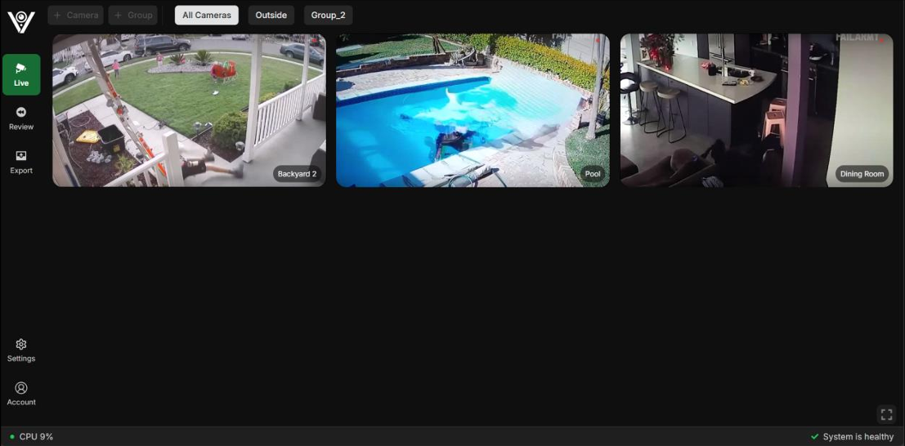

# Vigision: Advanced AI-Powered Home Surveillance System

Vigision is an innovative Network Video Recorder (NVR) and AI Computer Vision software designed to transform traditional home camera systems into proactive guardians. Leveraging advanced Deep Learning technologies, Vigision offers features such as object detection, pose estimation, and intelligent motion detection to provide reliable, intelligent protection for your home and loved ones.


---

## 🚀 Product Features

- **AI-Driven Alerts**: Only significant movements trigger alerts, reducing unnecessary notifications.
- **Fall Detection**: Proactively monitors vulnerable family members.
- **Self-Hosting**: Host on local hardware using Docker for enhanced security and privacy.
- **Global Accessibility**: Access and manage your system from anywhere.
- **Customizable**: Configure camera systems and features based on personal needs.

---

## 🛠️ Technologies Used

- **Frontend**: React, TypeScript, Vite, Tailwind CSS, Axios
- **Backend**: Flask, SQLite, peewee, PyTorch, OpenCV, YOLO, AlphaPose
- **DevOps**: Docker, NGINX, ngrok, ZeroMQ
- **Other Tools**: FFmpeg, NumPy, pandas, Python

---

## 🖼️ Screenshots


---

## 📋 Prerequisites

Before getting started, ensure you have the following installed:

- **Ubuntu** or **Ubuntu WSL on Windows**
- **Docker**

---

## 🚀 Getting Started

### Backend Setup
1. Open **WSL Ubuntu**.
2. Navigate to the project directory:
   ```bash
   cd frigate
   ```
3. Start the Docker containers:

   ```bash
   docker-compose up -d
   ```
4. Verify the backend version:

   ```bash
   make version
   ```
5. Run the backend:

   ```bash
   python3 -m frigate
   ```

### Frontend and Development Setup

1. Open **Visual Studio Code**.

2. Attach to the running Docker container:

   * Select the `frigate` container.
   * Choose the workspace directory. The first time it prompts for the code path, enter:

     ```
     /workspace/frigate
     ```
   * (Optional) Check the path by executing:

     ```bash
     pwd
     ```

     inside the container.

3. Install dependencies and start the frontend:

   ```bash
   npm install && npm run dev
   ```

---

## 🎥 Demonstration Video:

[Video_Demo](https://www.youtube.com/watch?v=K6VdnhWZfHo)

